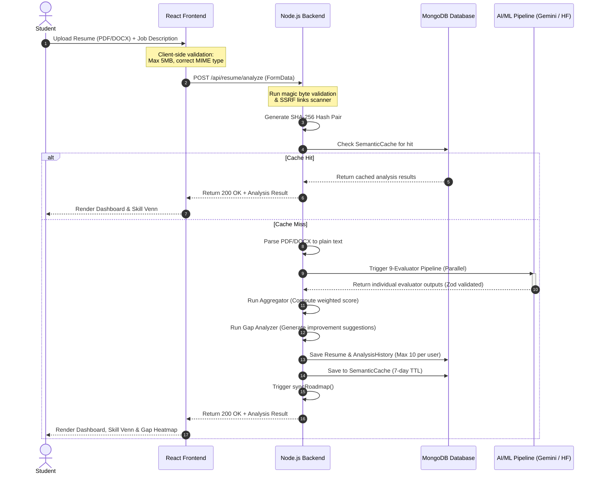

# Resume Analyzer Module

The AI Resume Analyzer provides comprehensive, multi-dimensional resume evaluation using a modular 9-evaluator pipeline. It supports dual modes—**Job Description (JD) Matching** and **Industry Benchmarking**—to score resumes on skill relevance, ATS readability, quantifiable impact, grammatical consistency, and technical depth.

---

## 1. System Architecture & Component Interactions



---

## 2. End-to-End Pipeline Workflow

### Phase A: Upload & Security Guardrails
1. **File Type & Signature Validation**:
   - The user uploads a file via `DragDropUpload`.
   - Before uploading, the frontend validates that the file size is under 5MB.
   - The server inspects the buffer headers using **magic byte helpers** (`validateResumeBufferSignatureSync`) to confirm that a renamed `.txt` file cannot bypass filters as a `.pdf`.
2. **SSRF Link Verification**:
   - The text is scanned for hyperlinks (e.g., LinkedIn, GitHub, portfolio).
   - Each link is passed to `verifyLink()` to prevent Server-Side Request Forgery (SSRF) by blocking private IPs (`127.0.0.1`, `192.168.x.x`), localhost, and cloud metadata endpoints (`169.254.169.254`).

### Phase B: Hashing & Semantic Caching
1. **Hash Generation**:
   - The server takes the SHA-256 hash of the plain-text resume content.
   - If a JD is provided, it generates a combined hash of `resumeText + jobDescriptionText`.
2. **Cache Lookup**:
   - The server queries the `SemanticCache` collection.
   - If a match is found, the pipeline bypasses AI model execution entirely, cutting analysis time from ~4 seconds down to under 200 milliseconds.
   - Cache entries have a **7-day Time-To-Live (TTL)** index.

### Phase C: Text Parsing
- If the cache misses, the server extracts raw text using `pdf-parse` or standard docx parsers.
- It extracts contact information, profile links, skills, experience blocks, and project sections.

### Phase D: The 9-Evaluator AI Pipeline
The core of the analyzer is a modular pipeline where all 9 evaluators execute concurrently using `Promise.all`:

```text
┌───────────────────────────────────────────────────────────────────────────────────┐
│                                runPipeline.js                                     │
├──────────────────────────┬─────────────────────────────┬──────────────────────────┤
│    skillMatch            │    keywordMatch             │    experienceMatch       │
│    (exact matches)       │    (synonym expansion)      │    (duration validation) │
├──────────────────────────┼─────────────────────────────┼──────────────────────────┤
│    semanticMatch         │    impactMatch              │    atsOptimization       │
│    (embeddings similarity)│    (quantifiable metrics)   │    (parser readiness)    │
├──────────────────────────┼─────────────────────────────┼──────────────────────────┤
│    readabilityMatch      │    consistencyMatch         │    techStandard          │
│    (power verbs scan)    │    (generic cliché check)    │    (domain breadth check)│
└──────────────────────────┴─────────────────────────────┴──────────────────────────┘
```

1. **`skillMatch`**: Measures direct intersections of hard and soft skills.
2. **`keywordMatch`**: Scans for specific keywords from the job description, using synonym matching.
3. **`experienceMatch`**: Checks duration of work experiences against required JD experience.
4. **`semanticMatch`**: Uses Hugging Face/Gemini Embeddings to compute cosine similarity between the resume text and the job description, capturing structural alignment even when different vocabularies are used.
5. **`impactMatch`**: Checks for quantifiable metrics (e.g., percentages, dollar amounts, multipliers like `2x`) and power verbs.
6. **`atsOptimization`**: Evaluates parseability, standard section headings, and contact block formatting.
7. **`readabilityMatch`**: Scores formatting, sentence lengths, and the presence of professional action verbs.
8. **`consistencyMatch`**: Scans for repetitive phrasing, overly generic clichés, and buzzwords.
9. **`techStandard`**: Benchmarks the breadth of skills against standard industry profiles (e.g., frontend, backend, fullstack).

---

## 3. Dual Scoring Modes

Scoring weights adjust automatically based on whether a job description is provided:

| Evaluator | Weight (JD Match Mode) | Weight (Benchmark Mode) | Primary Metric Target |
| :--- | :--- | :--- | :--- |
| **`semanticMatch`** | 20% | 0% | Semantic context similarity |
| **`skillMatch`** | 15% | 0% | Core skill overlap |
| **`keywordMatch`** | 15% | 0% | Exact keyword overlap |
| **`impactMatch`** | 15% | 40% | Quantified accomplishments |
| **`experienceMatch`** | 10% | 0% | Years of experience match |
| **`atsOptimization`** | 10% | 30% | Parser friendliness and sections |
| **`readabilityMatch`** | 10% | 15% | Flow, layout clarity, power verbs |
| **`consistencyMatch`** | 5% | 10% | Formatting and no jargon clichés |
| **`techStandard`** | 0% | 5% | Industry role standards alignment |

---

## 4. Database Models

### Resume Schema (`server/src/database/models/Resume.js`)

```javascript
{
  user: { type: Schema.Types.ObjectId, ref: 'User', required: true, index: true },
  title: { type: String, default: 'My Resume' },
  isActive: { type: Boolean, default: false },
  skills: [{ type: String }],
  experience: [{
    role: String,
    company: String,
    duration: String,
    description: String
  }],
  education: [{
    degree: String,
    institution: String,
    year: String
  }],
  projects: [{
    title: String,
    description: String,
    link: String
  }],
  linkedin: String,
  github: String,
  portfolio: String,
  resumeText: { type: String, select: false }, // Excluded from default queries for privacy
  file: {
    originalName: String,
    storedName: String,
    path: String,
    size: Number,
    mimeType: String
  },
  evaluation: {
    aggregatedScore: Number,
    mode: { type: String, enum: ['match', 'benchmark'] },
    classification: { type: String, enum: ['Beginner', 'Intermediate', 'Advanced', 'Strong Match'] },
    skillMatch: { score: Number, matched: [String], missing: [String] },
    keywordMatch: { score: Number, found: [String], missing: [String] },
    semanticMatch: { score: Number, similarityScore: Number },
    impactMatch: { score: Number, metricsFound: [String], suggestions: [String] },
    atsOptimization: { score: Number, issues: [String] },
    readabilityMatch: { score: Number, scoreReadability: Number, suggestions: [String] },
    gapAnalysis: {
      criticalGaps: [String],
      recommendedSkills: [String]
    }
  }
}
```

---

## 5. Endpoints Specifications

| Method | Endpoint | Auth | Request Payload | Response Success Payload (200 OK) |
| :--- | :--- | :--- | :--- | :--- |
| `POST` | `/api/resume/analyze` | Student | `FormData` { `file`: File, `jobDescription`: String } | `{ success: true, evaluation: { aggregatedScore: 82, ... }, classification: "Strong Match" }` |
| `GET` | `/api/resume/me/latest` | Student | None | `{ success: true, resume: { ... } }` |
| `PATCH` | `/api/resume/:id/active` | Student | None | `{ success: true, message: "Active resume updated successfully" }` |
| `POST` | `/api/resume/:id/cover-letter` | Student | `{ tone: "Professional", language: "English" }` | `{ success: true, coverLetter: { content: "...", tone: "Professional" } }` |

---

## 6. Integration Points with Other Modules

1. **Learning Roadmap Module**:
   - When an analysis finishes, the `gapAnalysis.criticalGaps` list is checked.
   - The backend triggers `syncRoadmap(userId, evaluation.gapAnalysis)`.
   - This creates or updates a dynamic **Learning Roadmap** with tailored resource links matching the missing skills.
2. **Job Matcher Module**:
   - The active resume's parsed skills feed directly into the **Job Recommendation Engine** (`GET /api/jobs/recommendations`).
   - Recommends relevant jobs based on semantic fit.
3. **Recruiter Talent Finder**:
   - Recruiters performing searches query the `skills` index of the `Resume` model.
   - Candidates are ranked based on their latest `aggregatedScore`.
